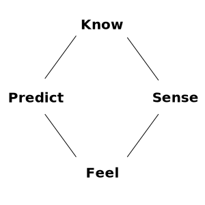

# From Operations to Functions

For early enzymes, it was a great fortune to stumble upon a membrane. They were never parting ways. Being able to let stuff out selectively, or let in only the good things, is excellent, but letting toxins in along with the good stuff is a death sentence. Sometimes you just need to get away from the danger, or from being digested alive. Protocells that connected detection to action gained an edge, an evolutionary advantage.

When you have a vocabulary and make a sentence, do you invent a new word every time? No, you use the words you already know following the rules of grammar. If a protocell reads the world in categories of either knowing (K), feeling (F), sensing (S), or predicting (P) - the vocabulary, then the rules for how we can combine them are the grammar.

## Grammar of Survival

In a world full of threats and competition, the smallest possible grammar with a two-word sentence already puts any protocell ahead of the pack. It is also the cheapest and the fastest one. Just add a word, and the metabolic costs jump, and the reaction time increases. If a protolife had to react, the reaction had to be spot&nbsp;on.

For this, we want the smallest possible set of pairs of events and reactions (or functions that map specific inputs to specific outputs) that can handle everything that life throws at a bounded system.

## 16 Possible Pairs

With just four categories in our vocabulary, we have only 16 possible pairs.

\\[
\begin{aligned}
K &\to K & S &\to K & F &\to K & P &\to K \\\\
K &\to S & S &\to S & F &\to S & P &\to S \\\\
K &\to F & S &\to F & F &\to F & P &\to F \\\\
K &\to P & S &\to P & F &\to P & P &\to P
\end{aligned}
\\]

Repeating that a cat is a cat adds nothing new. For a protocell, it is a wasted effort. Pairs such as \\(K \to K\\) and \\(F \to F\\) do not create a selective advantage and do not belong to our grammar, so we are left with 12 pairs.

\\[
\begin{aligned}
K &\to S & S &\to K & F &\to K & P &\to K \\\\
K &\to F & S &\to F & F &\to S & P &\to S \\\\
K &\to P & S &\to P & F &\to P & P &\to F
\end{aligned}
\\]

## The Halting Problem

Four of these are fragile. For example, a jump from Know (Internal, Objective) to Feel (Internal, Subjective) stays internal, going from objective to subjective in a single step, changing the meaning of a signal (a molecule) without doing any work on it on the boundary.

Such a jump changes the internal state, which can change it again, and so on. Whether it converges depends on the specific chemistry, the specific initial signal, and the specific internal conditions. Predicting whether this loop will halt is exactly as hard as the general halting problem: the cell would need to simulate itself to completion to know if it ever stops, which is the very thing Turing proved impossible. The simple life did not take chances and completely excluded them.

A counterexample: an internalized molecule (K) creates a sensation in a membrane protein (S) beyond the activation threshold. It just validated the existing inconclusive opinion about the environment: the boundary serves as a reality check, grounding the action in certainty. The cell responds and persists, without any risk of&nbsp;non-termination.

Here's another fragile example: a protocell detects (S) a chemical at its surface, sensing something. Instead of internalizing it (K) or triggering an internal response (F), it directly secretes (P) a molecule outward based on what it sensed. Now the secreted molecule is in the same external space that the cell is sensing, and the cell senses its own secretion. Predicts again, senses that prediction. Rinse and repeat, burning scarce fuel and reducing the chances of survival. It might halt, it might not, but the cost is not recoverable.

## The Rule of the Boundary

Changes in the meaning of a signal (from objective to subjective, or vice versa) are only allowed after crossing the boundary because, without it, the flip is a relabeling, the same as if the system declared that the signal is more than it is, based on nothing but the system's own prior state, creating an unstable function.

Following this rule, we have to exclude these four:

- Know (Internal, Objective) \\(\to\\) Feel (Internal, Subjective)
- Sense (Objective, External) \\(\to\\) Predict (Subjective, External)
- Feel (Subjective, Internal) \\(\to\\) Know (Objective, Internal)
- Predict (Subjective, External) \\(\to\\) Sense (Objective, External)

## Final Eight

We're left with a minimal, sufficient yet stable set of 8 functions. 

\\[
\begin{aligned}
K &\to S & \qquad S &\to K \\\\
K &\to P & \qquad P &\to K \\\\
F &\to P & \qquad P &\to F \\\\
S &\to F & \qquad F &\to S
\end{aligned}
\\]

I arranged the functions so you can see the pattern: it is a cycle graph on four vertices (\\(K\text{-}S\\), \\(S\text{-}F\\), \\(F\text{-}P\\), \\(P\text{-}K\\)), where only moves to adjacent positions are valid.

You can't reason about eight unlabeled things, even if they are the fundamental verbs of existence, valid moves a living thing can make to stay alive. Billions of years old, they left a deep imprint on our language, and if a move is real, we have a word for it.
